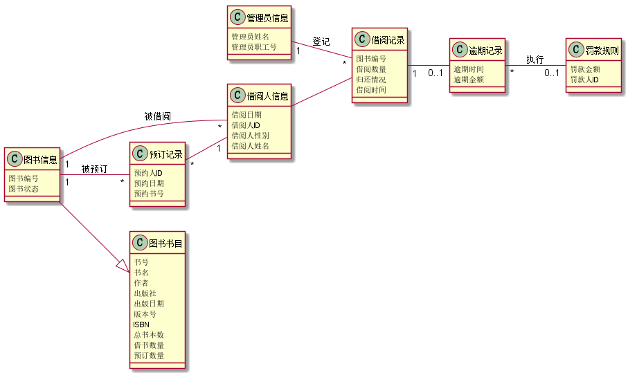
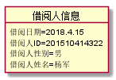
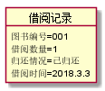
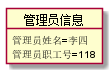
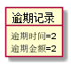
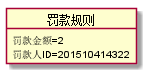
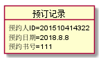
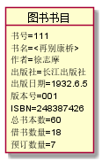
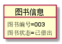

# 实验三：图书管理系统领域对象建模
|        学号      |     班级    |    姓名    |
|:----------------:|:-----------:|:----------:|
|   201510414322   |    软工15-3 |    杨军  | 
## 1.图书管理系统的类图
### 1.1 类图PlantUML源码如下：
<pre>
    @startuml
left to right direction
class 借阅人信息{
    借阅日期
    借阅人ID
    借阅人性别
    借阅人姓名
   }
class  借阅记录{
    图书编号
    借阅数量
    归还情况
    借阅时间
}
class 管理员信息{
    管理员姓名
    管理员职工号
}
class 逾期记录{
逾期时间
逾期金额
}

class 罚款规则{
    罚款金额
    罚款人ID

}
class 预订记录{
    预约人ID
    预约日期
    预约书号
}
class 图书书目{
    书号
    书名
    作者
    出版社
    出版日期
    版本号
    ISBN
    总书本数
    借书数量
    预订数量
}
class 图书信息{
    图书编号
    图书状态
}
借阅人信息 -- 借阅记录
管理员信息 "1" -- "*"借阅记录 :登记
借阅记录"1" -- "0..1"逾期记录
逾期记录"*" -- "0..1"罚款规则:执行
预订记录"*" -- "1"借阅人信息
图书信息 --|> 图书书目
图书信息"1" -- "*"借阅人信息 :被借阅
图书信息"1" -- "*"预订记录 :被预订
@enduml
</pre>
### 1.2 类图如下:

### 1.3 类图说明：
##### （1）借阅人信息
    借阅人信息类属性有很多，包括日期，ID，姓名，性别等。
##### （2）管理员信息
    管理员属性有姓名和职工号，其主要操作为对借阅者执行相关操作。
##### （3）借阅记录信息
    借阅记录信息属性有借阅的时间，书籍和数量等。
##### （4）逾期记录
    逾期记录是对借阅的过期时间和金额进行操作。
##### （5）罚款规则
    罚款规则是针对于逾期记录所指定处罚原则。
##### （6）预订记录
    预订记录是借阅者对某本书的预订信息类，包括借书ID、预订日期。
##### （7）图书书目
    图书书目属性是对当前管藏的书籍数量，出版社，借阅情况的一个汇总。
##### （8）图书信息
    图书信息属性包括书籍ID和数量等
## 2.图书管理系统的对象图
### 2.1 借阅人信息类的对象图
#### 源码如下：
    @startuml
    object 借阅人信息{
               借阅日期=2018.4.15
               借阅人ID=201510414322
               借阅人性别=男
               借阅人姓名=杨军
              }
    @enduml
#### 对象图如下：

### 2.2 借阅记录类的对象图
#### 源码如下：
    @startuml
    object 借阅记录{
               图书编号=001
               借阅数量=1
               归还情况=已归还
               借阅时间=2018.3.3
           }
    @enduml
#### 对象图如下：

### 2.3 管理员信息类的对象图
#### 源码如下：
    @startuml
    object 管理员信息{
               管理员姓名=李四
               管理员职工号=118
           }
    @enduml
#### 对象图如下：

### 2.4逾期记录类的对象图
#### 源码如下：
    @startuml
    object 逾期记录{
     逾期时间=2
     逾期金额=2
}
    @enduml
#### 对象图如下：

### 2.5 罚款规则类的对象图
#### 源码如下：
    @startuml
    object 罚款规则{
    罚款金额=2
    罚款人ID=201510414322

}
    @enduml
#### 对象图如下：

### 2.6 预订记录类的对象图
#### 源码如下：
    @startuml
    object 预订记录{
    预约人ID=201510414322
    预约日期=2018.8.8
    预约书号=111
}
    @enduml
#### 对象图如下：

### 2.7 图书书目类的对象图
#### 源码如下：
    @startuml
    object 图书书目{
    书号=111
    书名=<再别康桥>
    作者=徐志摩
    出版社=长江出版社
    出版日期=1932.6.5
    版本号=001
    ISBN=248387426
    总书本数=60
    借书数量=18
    预订数量=7
}
    @enduml
#### 对象图如下：

### 2.8 图书书目类的对象图
#### 源码如下：
    @startuml
    object 图书信息{
    图书编号=003
    图书状态=已借出
}
    @enduml
#### 对象图如下：

