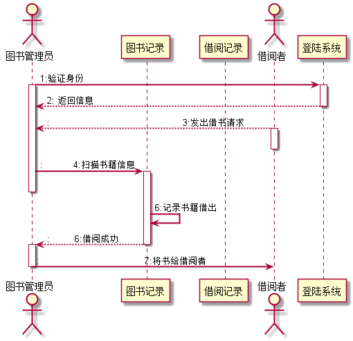
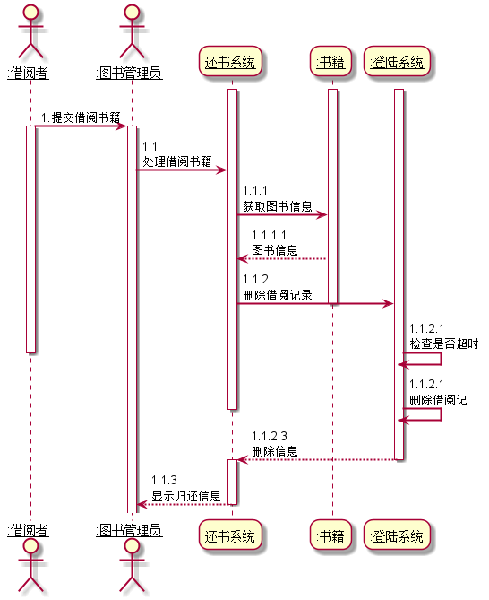
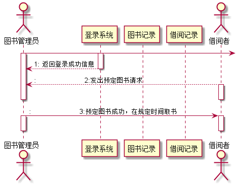
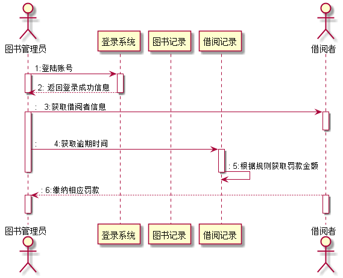
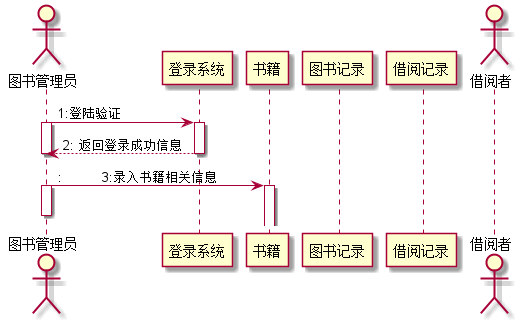

# 实验四：图书管理系统顺序图绘制
|        学号      |     班级    |    姓名    |
|:----------------:|:-----------:|:----------:|
|   201510414322   |    软工15-3 |    杨军  | 

## 1.借阅者借阅图书时序图
### 1.1 借阅者借阅图书时序图PlantUML源码如下：
<pre>
   @startuml
   skinparam sequenceArrowThickness 2
          actor 图书管理员
          participant "图书记录"
          participant "借阅记录"
          actor "借阅者"
   
          图书管理员 -> 登陆系统: 1:验证身份
          activate 图书管理员
          activate 登陆系统
          登陆系统-->图书管理员: 2: 返回信息
          deactivate 登陆系统
   
          借阅者 -->图书管理员::                           3:发出借书请求
          activate 借阅者
          deactivate 借阅者
   
          图书管理员 -> 图书记录::           4:扫描书籍信息
          activate 图书记录
          deactivate 图书管理员
   
          图书记录->图书记录:6:记录书籍借出
          图书记录-->图书管理员::         6:借阅成功
          deactivate 图书记录
   
          activate 图书管理员
          图书管理员 ->借阅者::                                      7:将书给借阅者
          deactivate 图书管理员
   @enduml
</pre>
### 1.2 类图如下:

## 2.借阅者返还图书时序图
### 2.1 借阅返还图书的源码如下：
    @startuml
              skinparam sequenceArrowThickness 2
              skinparam roundcorner 20
              skinparam maxmessagesize 60
              skinparam sequenceParticipant underline
    
              actor ":借阅者" as User
              note left of User #aqu
              end note
              actor ":图书管理员" as Lib
              participant "还书系统" as A
              participant ":书籍" as B
              participant ":登陆系统" as C
              activate A
              activate B
              activate C
              User -> Lib: 1.提交借阅书籍
              activate User
              activate Lib
              Lib -> A: 1.1 处理借阅书籍
              A -> B: 1.1.1 获取图书信息
              B --> A: 1.1.1.1  图书信息
              A -> C: 1.1.2  删除借阅记录
              deactivate B
              C -> C:1.1.2.1 检查是否超时
              deactivate User
              C -> C:1.1.2.1 删除借阅记
              deactivate A
              deactivate B
              C --> A: 1.1.2.3  删除信息
              deactivate C
              activate A
              A -->Lib:1.1.3 显示归还信息
              deactivate A
    
    @enduml
#### 2.2对象图如下：

## 3.预定图书时序图
### 3.1预定图书源码如下：
    @startuml
        actor 图书管理员
        participant "登录系统"
        participant "图书记录"
        participant "借阅记录"
        actor "借阅者"
        图书管理员 ->
        activate 图书管理员
        activate 登录系统
        登录系统-->图书管理员: 1: 返回登录成功信息
        deactivate 登录系统
    
        借阅者 -->图书管理员::                        2:发出预定图书请求
        activate 借阅者
        deactivate 借阅者
        deactivate 图书管理员
    
        deactivate 图书记录
        deactivate 图书管理员
    
        图书管理员->借阅者 ::                        3:预定图书成功，在规定时间取书
        activate 图书管理员
        activate 借阅者
        deactivate 图书管理员
        deactivate 借阅者
    @enduml
#### 3.2类图如下：

## 4.管理员处理罚款的时序图
### 4.1管理员处理罚款的时序图源码如下：
    @startuml
           actor 图书管理员
           participant "登录系统"
           participant "图书记录"
           participant "借阅记录"
           actor "借阅者"
    
           图书管理员 -> 登录系统: 1:登陆账号
           activate 图书管理员
           activate 登录系统
           登录系统-->图书管理员: 2: 返回登录成功信息
           deactivate 登录系统
           deactivate 图书管理员
    
           图书管理员->借阅者::   3:获取借阅者信息
           activate 图书管理员
           activate 借阅者
           deactivate 借阅者
    
           图书管理员->借阅记录 ::       4:获取逾期时间
           activate 借阅记录
           借阅记录->借阅记录:: 5:根据规则获取罚款金额
           deactivate 图书管理员
           deactivate 借阅记录
    
           借阅者-->图书管理员 :: 6:缴纳相应罚款
           activate 图书管理员
           activate 借阅者
           deactivate 图书管理员
           deactivate 借阅者
     @enduml
#### 4.2类图如下：

## 5.管理图书对象的时序图
### 5.1管理图书对象的时序图源码如下：
    @startuml
    
        actor 图书管理员
        participant "登录系统"
        participant "书籍"
        participant "图书记录"
        participant "借阅记录"
        actor "借阅者"
    
        图书管理员 -> 登录系统: 1:登陆验证
        activate 图书管理员
        activate 登录系统
        登录系统-->图书管理员: 2: 返回登录成功信息
        deactivate 登录系统
        deactivate 图书管理员
    
        图书管理员-> 书籍::          3:录入书籍相关信息
        activate 图书管理员
        activate 书籍
        deactivate 图书管理员
    
    @enduml
####5.2 类图如下：

