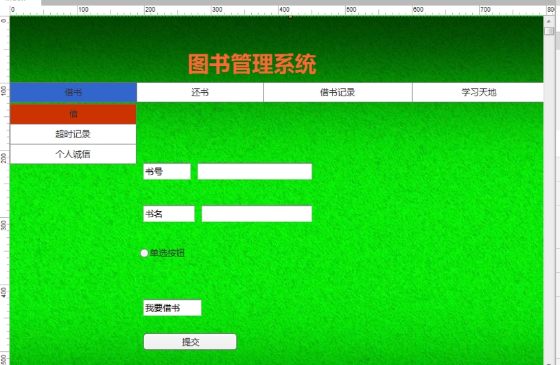

# 实验五：图书管理系统数据库设计与界面设计
<table>
<tr>
<td>学号</td>
<td>班级</td>
<td>姓名</td>
<td>照片</td>
</tr>
<tr>
<td>201510414322</td>
<td>2015级软件工程三班</td>
<td>杨军</td>
<td></td>
</tr>
</table>

## 1 数据库表设计
### 1.1 图书类
|字段|类型|主键，外键|可以为空|默认值|约束|说明|
|:-:|:-:|:-:|:-:|:-:|:-:|:-:|
|国际出版号|bigint|主键|否|||图书的唯一标识|
|书名|varchar(64)||否|||图书的名称|
|作者|varchar(32)||否|||图书的作者|
|简介|varchar(256)||是|空||图书的简介|
|可借数量|int||否|||图书的还可以借出的数量|
|价格|float||否|||图书的价格信息|
|出版社|varchar(64)||否|||图书的出版社信息|
|出版日期|date||否|||图书的出版日期|

### 1.2 管理员类
|字段|类型|主键，外键|可以为空|默认值|约束|说明|
|:-:|:-:|:-:|:-:|:-:|:-:|:-:|
|职工编号|bigint|主键|否|||系统管理员的职工编号|
|职工姓名|varchar(64)||否|||系统管理员的职工姓名|

### 1.3 借阅人信息类
|字段|类型|主键，外键|可以为空|默认值|约束|说明|
|:-:|:-:|:-:|:-:|:-:|:-:|:-:|
|姓名|varchar(32)|主键|否|||借阅人姓名|
|性别|varchar(2)||否|||借阅人性别|
|ID|int||否|||借阅人的ID|
|借阅日期|datatime||否|||借阅人的借阅日期|

### 1.4 借阅记录类
|字段|类型|主键，外键|可以为空|默认值|约束|说明|
|:-:|:-:|:-:|:-:|:-:|:-:|:-:|
|图书编号|bigint|主键|否|||借阅的书籍编号|
|借阅数量|int||否|||借阅的书籍数量|
|借书日期|date||否|||借书日期记录|
|归还情况|int||否|||借书的归还情况|

### 1.5 逾期记录
|字段|类型|主键，外键|可以为空|默认值|约束|说明|
|:-:|:-:|:-:|:-:|:-:|:-:|:-:|
|逾期人ID|int|主键|否|||读者的个人ID|
|逾期时间|int||否|||读者逾期的时间|
|逾期金额|float||否|||读者逾期处罚的金额|

### 1.6 罚款规则
|字段|类型|主键，外键|可以为空|默认值|约束|说明|
|:-:|:-:|:-:|:-:|:-:|:-:|:-:|
|罚款人ID|int|主键|否|||接受罚款人的ID|
|罚款人的金额|float||否|||接受罚款人应缴纳的金额|

### 1.7 预定记录
|字段|类型|主键，外键|可以为空|默认值|约束|说明|
|:-:|:-:|:-:|:-:|:-:|:-:|:-:|
|预约人ID|int|主键|否|||预约书籍的读者ID|
|预约日期|datatime||否|||预约书籍的时间|
|预约书号|int||否|||预约书籍的书号|

## 2.界面设计
### 2.1 借书界面

<li>用例图参见：借书用例</li>
<li>类图参见：借书类</li>
<li>顺序图参见：借书顺序图</li>
<li>API接口如下</li>

#### 1.获取图书信息
<li>获取图书信息</li>
<li>请求地址：http://localhost/v1/api/return_books</li>
<li>请求方法：POST</li>
<li>请求参数：</li>

|参数名称|必填|说明|
|:-:|:-:|:-:|
|书号|是|用于验证请求的认证信息|
|bookInofr|是|用于检索图书的信息|
<li>返回实例</li>

   {
       "info": "查询成功,返回信息",
       "data": {
           "bookNumber": "00001",
           "bookName": "helloworld",
           "author": "JEN",
           "press": "工业出版社",
           "publishDate": "2018-1-15",
           "version": "第五版",
           "ISBN": "675-7-334-17148-9",
           "allNumber": "88",
           "lendNumber": "20",
           "reserveNumber": "68",
           },
       "code": 200
   }

  |参数名称|说明|
  |:-:|:-:|
  |infor|返回信息|
  |data|返回检索到的图书信息|