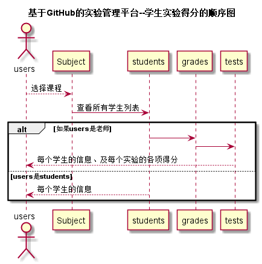

# “查看成绩”用例 [返回](./README.md)
## 1. 用例规约

|用例名称|查看成绩|
|-------|:-------------|
|功能|学生和老师查看成绩|
|参与者|学生、老师|
|前置条件|成绩评定完成|
|后置条件| |
|主流事件|成绩评定完成后可以查看成绩 |
|备注| |

## 2. 业务流程（顺序图） [源码](./chakan.puml)
 

## 3. 界面设计
- API接口调用
    - 接口1：[chakan](../接口/ck.md) 
    
## 4. 算法描述（活动图）

- STUDENT_RESULT解析为列表。
- STUDENT_RESULT为接口getStudentGrades的返回值，返回值为数组，数组元素为单项成绩打分要求与具体得分，前台直接根据列表显示数据，在列表之后显示作业评价。

## 5. 参照表

- [students](../Database.md)
- [teachers](../Database.md)
- [subjects](../Database.md)

## 6. API接口设计

- 接口名称：check_grade
    
- 功能：
    通过成绩id以及学生id查询成绩表中的每个学生具体各项得分。
    
    该接口服务于：http://202.115.82.8:1522
    

- 请求方式 ：
    GET  

- 请求参数说明:        
    请求参数为：gradesId，通过grades查找具体的得分项数据。
    
- 返回实例：

        {
            "status": true,
            "student_result"：{
                ["界面完成",20]
                ["运行结果",40]
                ["难度",20]
            }
        }
  
- 返回参数说明：    
 
  |参数名称|说明|
  |:---------:|:--------------------------------------------------------|      
  |status|bool类型，true表示正确的返回，false表示有错误|
  |student_result|数组类型|