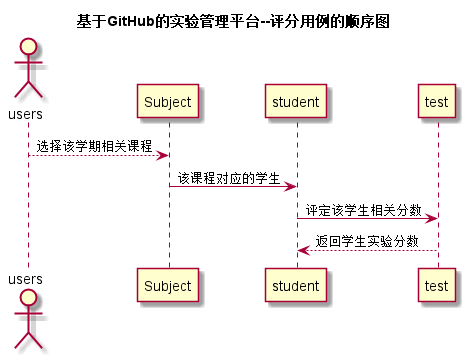

# “评定成绩”用例 [返回](./README.md)
## 1. 用例规约

|用例名称|评定成绩用例|
|-------|:-------------|
|功能|老师进行打分|
|参与者|老师|
|前置条件|学生作业上传|
|后置条件| |
|主流事件| 对上传的实验按照标准进行分数评定|
|备注| |

## 2. 业务流程（顺序图） [源码](./pingding.puml)
 

## 3. 界面设计
- API接口调用
    - 接口1：[pingding](../接口/pd.md) 

## 4. 算法描述（活动图） 

无
## 5. 参照表

- [students](../Database.md)
- [teachers](../Database.md)
- [subjects](../Database.md)
## 6. API接口设计

- 接口名称：pingding
    
- 功能：
    老师上传给每个学生的作业得分。   
    
    该接口服务于：http://202.115.82.8:1522
    
- 请求方式 ：
    GET  

- 请求参数说明:        
    请求参数为：student_id，score，test_id。student_id确实学生，test_id确实作业Id，score中包含所有的得分项及得分。
    
- 返回实例：

        {
            "status": true
        }
  
- 返回参数说明：    
 
  |参数名称|说明|
  |:---------:|:--------------------------------------------------------|      
  |status|bool类型，true表示正确的返回，false表示有错误|
