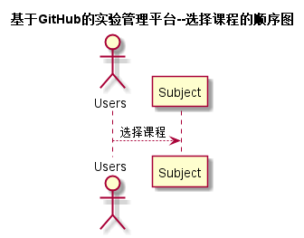

# “选择课程”用例 [返回](./README.md)
## 1. 用例规约

|用例名称|选择课程|
|-------|:-------------|
|功能|用户登录之后需要确定选择的课程名称|
|参与者|学生，老师|
|前置条件|学生，老师需要先登录到自己的账号|
|后置条件| |
|主流事件| |
|备注| |

## 2. 业务流程（顺序图） [源码](../xuanze.puml)
 

## 3. 界面设计
- 界面参照: https://zwdbox.github.io/is_analysis/test6/ui/顶部菜单.html
- API接口调用
    - 接口1：[xuanke](../接口/xk.md) 

## 4. 算法描述（活动图）

无
## 5 参照表

-- [students](../Database.md)
 - [teachers](../Database.md)
 - [subjects](../Database.md)

